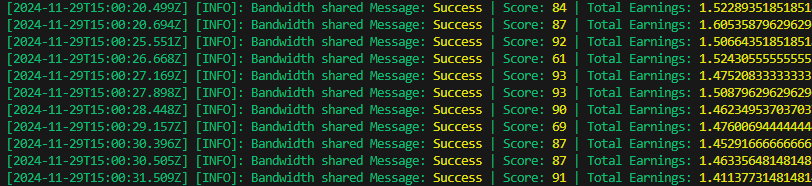
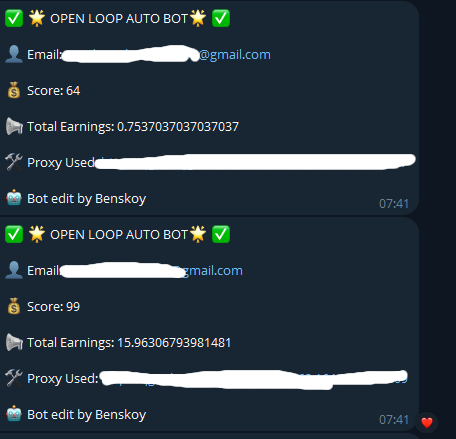

# OpenLoop Decentralized bandwidth
OpenLoop Network is a decentralized wireless network built to enhance Internet service delivery, making it more efficient, accessible, and rewarding for everyone. 🤩

- Register [https://openloop.so/](https://openloop.so/)
- Reff Code = ol5391f334

## **Features**

- **Register Accounts**
- **Load Existing Tokens**: Load pre-existing tokens if you already have account.
- **Auto Ping**
- **Auto Reff**
- **Support Multy Accounts**
- **Support Proxy**

## **Requirements**

- **Node.js**: Ensure you have Node.js installed.
- **npm**: Ensure you have npm installed.

## **make sure you have same number account and proxy**

if you already have account you can put `access-token` to `token.txt`,

put your proxy in file `proxies.txt` format `http://username:pass@ip:port`



## Setup

1. Clone this repository:
   ```bash
   git clone https://github.com/bebenmahardika/OpenLoop_Bot.git
   cd OpenLoop_Bot
   ```
2. Install dependencies:
   ```bash
   npm install
   ```
3. Setup bot telegram:
   ```bash
   nano config.js
   ```
4. Setup proxies:
   ```bash
   nano proxies.txt
   ```
5. Setup to create accounts and get Tokens:
   ```bash
   npm run setup
   ```
6. Run The Script:
   ```bash
   npm run start
   ```

## 

This project is licensed under the [MIT License](LICENSE).
Source https://github.com/Zlkcyber
